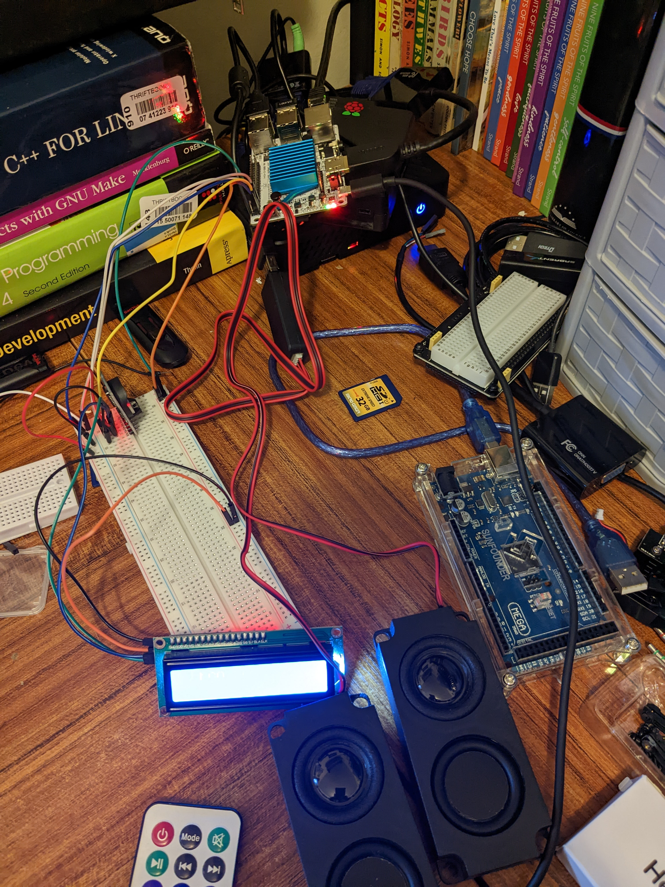

# mocp_i2c_lcd_ir_remote

## What Is it and what does it do?

This is a couple scripts intended to be run in the background allowing a user to control moc using an ir remote and displaying whats playing on an I2C lcd.

## Pre Work ##

* You need the I2C bus available in linux and the LCD wired to it.  
* You also need permissions set on the I2C device set so the user running scripts can use it. 
* You need the IR reciever setup with LIRC, remote configured and getting proper keycodes with evtest.
* You need mocp installed and tested.  

In my testing I'm using an Libre Computer Board AML-S905X-CC (Le Potato) which has a built in IR reciever and I'm using a 2 line I2C LCD at 5v on the same I2C bus as a 3.3v RTC.

* IR Receiver Setup https://wiki.adrenlinerush.net/doku.php?id=ir_receiver_setup_on_le_potato
* MOC Configuration https://wiki.adrenlinerush.net/doku.php?id=moc_musc_on_the_console_setup_on_le_potato
* I2C LCD Setup *** Specific Documenation Not Done Yet *** You could follow my documentation on adding an RTC (towards bottom of page: https://wiki.adrenlinerush.net/doku.php?id=libre_computer_board_aml-s905x-cc_le_potato) and use the same pins for SDA and SCL but grab power from one of the 5v pins and another ground from the GPIO pinout referenced below.  You need the i2c-ao overlay loaded for the LCD to work.  This is how I have it configured in the picture below.
* For a normal user to access it you need to create an I2C group, change group owership and posix permissions and then add user to group. (As root)
<pre>
emerge acct-group/i2c
chgrp i2c /dev/i2c*
chmod 660 /dev/i2c*
gpasswd -a your_user i2c
</pre>

## Dependencies ##

<pre>
emerge --ask dev-python/smbus2 dev-python/python-evdev
</pre>

## Running ##

<pre>
bash moc_wrapper
</pre>

## In Use ##

